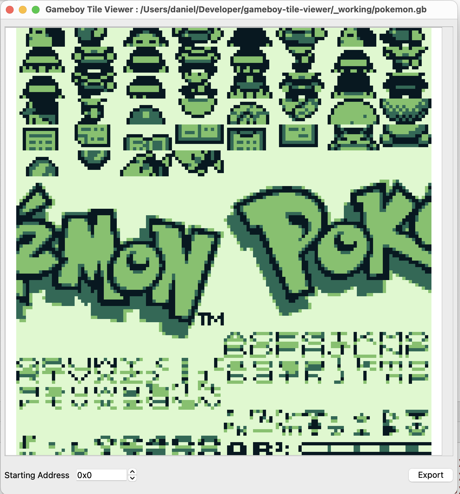

# GameBoy TileViewer

Tile viewer and exporter for GameBoy ROMs.

### Progress

- [x] Viewing
- [x] Export
- [x] Offset
- [ ] Size Changing
- [ ] Zoom in/out
- [ ] GBC/GBA

### Dependencies

* C++ compiler with C++23 support
* Qt6

## License

See [LICENSE](LICENSE) for more details.
